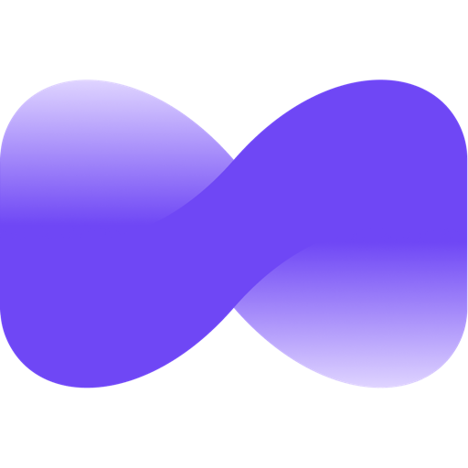

# PopiStudio

<p align="center">
  
</p>

<p align="center">
  <strong>Cross-platform desktop workspace for Popiai, an AI coworking agent powered by OpenClaw.</strong>
</p>

<p align="center">
  <a href="LICENSE"></a>
  <br>
  
  <br>
  
  
</p>

<p align="center">
  English · <a href="README_zh.md">中文</a>
</p>

---

**PopiStudio** is the desktop application for **Popiai**. It gives Popiai a local,
supervised workspace where the agent can chat, run tools, operate files, execute
commands, preview generated artifacts, manage skills, and work with scheduled or
IM-triggered tasks.

The app is built with Electron, React, TypeScript, Tailwind CSS, SQLite, and
OpenClaw. It targets macOS, Windows, and Linux desktop distribution.

## What PopiStudio Does

- **Cowork Agent Sessions**: Start AI working sessions that stream progress,
  request permissions, and persist conversation history locally.
- **Local Workspace Execution**: Let the agent work in selected folders with
  explicit user approval for sensitive file, terminal, and network actions.
- **Artifacts Preview**: Render HTML, SVG, Mermaid, React, and code outputs in a
  dedicated preview panel.
- **Skills System**: Package reusable workflows such as web search, Office
  document generation, PDF processing, Playwright automation, and media tools.
- **Scheduled Tasks**: Create recurring tasks and bind them to Cowork sessions or
  IM delivery routes.
- **IM Integrations**: Connect external channels such as WeChat, WeCom, DingTalk,
  Feishu, QQ, Telegram, Discord, NetEase IM, NetEase Bee, and POPO.
- **Local Persistence**: Store app settings, auth tokens, Cowork sessions, and
  task metadata in local SQLite databases.
- **Cross-Platform Packaging**: Build macOS, Windows, and Linux installers from
  the same codebase.

## Platform Outputs

| Platform | Build Script | Output |
| --- | --- | --- |
| macOS | `npm run dist:mac` | `.dmg` |
| macOS Intel | `npm run dist:mac:x64` | x64 `.dmg` |
| macOS Apple Silicon | `npm run dist:mac:arm64` | arm64 `.dmg` |
| macOS Universal | `npm run dist:mac:universal` | universal `.dmg` |
| Windows | `npm run dist:win` | NSIS `.exe` installer |
| Linux | `npm run dist:linux` | AppImage and Debian package |

Packaging uses the Popiai icon assets under `public/icons` and `build/icons`.

## Quick Start

### Requirements

- Node.js `>=24 <25`
- npm

### Install and Run

```bash
git clone https://github.com/wtgoku-create/PopiStudio.git
cd PopiStudio

npm install
npm run electron:dev
```

The Vite development server runs at `http://localhost:5175`.

`npm run electron:dev` starts both the Vite renderer and the Electron main
process with hot reload.

### OpenClaw Runtime

OpenClaw is the primary agent runtime. The pinned version is declared in
`package.json` under `openclaw.version`.

```bash
# Build or reuse the pinned OpenClaw runtime, then start dev mode.
npm run electron:dev:openclaw
```

Useful environment variables:

```bash
# Use a local OpenClaw checkout.
OPENCLAW_SRC=/path/to/openclaw npm run electron:dev:openclaw

# Force runtime rebuild.
OPENCLAW_FORCE_BUILD=1 npm run electron:dev:openclaw

# Skip automatic OpenClaw checkout/version switching.
OPENCLAW_SKIP_ENSURE=1 npm run electron:dev:openclaw
```

## Development Commands

```bash
# Renderer only
npm run dev

# Electron development app
npm run electron:dev

# TypeScript + production renderer/main/preload build
npm run build

# Compile Electron main process only
npm run compile:electron

# Run Vitest suite
npm test

# Run ESLint
npm run lint
```

## Packaging

The general distribution pipeline builds the renderer, Electron main process,
skills, platform runtime assets, and installer package.

```bash
# Current platform directory package
npm run pack

# Current platform installer
npm run dist

# Platform-specific installers
npm run dist:mac
npm run dist:win
npm run dist:linux
```

Desktop packages bundle the prepared OpenClaw runtime under `Resources/cfmind`.
Windows packages can also include a portable Python runtime under
`resources/python-win`.

Offline or private build environments can override Python runtime sources:

- `POPIAI_PORTABLE_PYTHON_ARCHIVE`
- `POPIAI_PORTABLE_PYTHON_URL`
- `POPIAI_WINDOWS_EMBED_PYTHON_VERSION`
- `POPIAI_WINDOWS_EMBED_PYTHON_URL`
- `POPIAI_WINDOWS_GET_PIP_URL`

## Architecture

PopiStudio uses strict Electron process isolation. Renderer code never accesses
Node.js directly; all privileged operations go through preload-exposed IPC APIs.

### Main Process

`src/main/main.ts`

- Window lifecycle
- SQLite persistence
- Auth and API proxy helpers
- OpenClaw runtime lifecycle
- Cowork engine routing
- IM gateway management
- Skill management
- Scheduled task integration

### Preload

`src/main/preload.ts`

- Exposes the safe `window.electron` API with `contextBridge`
- Provides Cowork stream listeners and IPC wrappers

### Renderer

`src/renderer/`

- React UI
- Redux state slices
- Settings, Cowork, Artifacts, Skills, IM, and task views
- i18n and API service wrappers

## Repository Layout

```text
src/main/                  Electron main process and privileged services
src/renderer/              React renderer application
src/shared/                Shared constants and types
src/scheduledTask/         Scheduled task domain logic
SKILLs/                    Built-in Popiai skills
openclaw-extensions/       Local OpenClaw extension plugins
scripts/                   Build, runtime, packaging, and patch scripts
build/icons/               Platform packaging icons
public/icons/              Source Popiai icon resource pack
resources/                 Packaged runtime resources
tests/                     Node-based integration and regression tests
specs/                     Design notes and implementation specs
```

## Branding

- Product name: **Popiai**
- Repository/application workspace: **PopiStudio**
- App ID: `popiai`
- Desktop URL scheme: `popiai://`
- Local database: `popiai.sqlite`

OpenClaw provider fallback IDs such as `lobster` are compatibility identifiers
inside the OpenClaw provider layer and are not product branding.

## License

MIT. See [LICENSE](LICENSE).
